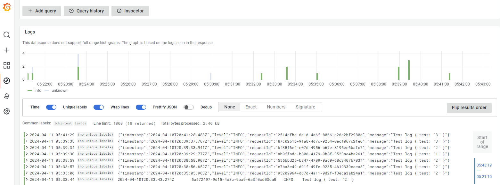

# Lambda Logs API Extension in Go



The provided code sample demonstrates how to get a basic Logs API extension written in Go up and running.

This extension:

- Subscribes to recieve platform and function logs
- Runs with a main and a helper goroutine: The main goroutine registers to ExtensionAPI and process its invoke and shutdown events (see nextEvent call). The helper goroutine:
  - starts a local HTTP server at the provided port (default 1234) that receives requests from Logs API
  - puts the logs in a synchronized queue (Producer) to be processed by the main goroutine (Consumer)
- Writes the received logs to an Loki

## Compile package and dependencies

To run this example, you will need to ensure that your build architecture matches that of the Lambda execution environment by compiling with `GOOS=linux` and `GOARCH=amd64` if you are not running in a Linux environment.

```bash
$ task build
```

## Layer Setup Process

Add the newly created layer version to a Lambda function.

```bash
$ task publish
```

## Function Invocation and Extension Execution

Configure the extension by setting below environment variables

- `LOKI_PUSH_URL` - This is the URL to your Loki instance. It should include the scheme (http or https), the hostname, and the port number if applicable. Do not include the API endpoint path (/loki/api/v1/push) in this URL; the extension will automatically append the necessary path to this base URL.

  > Example: `http://localhost:3100`

- `LOKI_AUTH_TOKEN` - The authentication token required for pushing logs to your Loki instance. This token is used to authenticate the requests made from the extension to the Loki server. Depending on your Loki setup, this might be a "Bearer" token or another form of API key.
  > Example: `eyJhbGciOiJIUzI1NiIsInR5cCIgOiAi...`

## Docker base image layer for Docker based Lambda functions

```bash
$ task docker-arm
$ task docker-amd
$ task publish-docker
```

> **NOTE**
>
> This base image is to copy the extension layer to your application base image - it can't be run directly

Example use of `Loki log` extension base image in Docker based lambda deployment.
